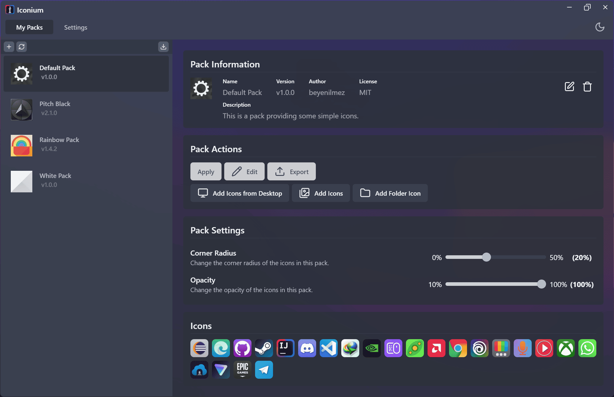

# Desktop Manager

Icon and description editor, profile creation tool for your desktop. (WIP)

## Screenshots

## Features

- Create desktop profiles
- Edit icon and description
- Shortcut (.lnk) support

## Planned

- Save desktop layout to profile
- Share profiles as files
- Folder and .url support
- Sync desktop with profile

## Built With

- [Wails](https://wails.io/)
- [React](https://react.dev/)
- [tailwindcss](https://tailwindcss.com/)
- [shadcn-ui](https://ui.shadcn.com/)
- [lucide-react](https://lucide.dev/guide/packages/lucide-react)

## License

Distributed under the MIT License. See [LICENSE](https://github.com/beyenilmez/desktop-manager/blob/main/LICENSE) for more information.

