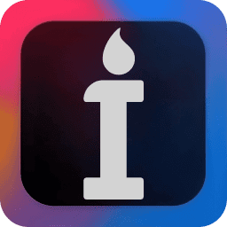

# Iconium

<p align="center">
  <a href="https://github.com/beyenilmez/iconium">
    
  </a>
  <br/>
  <a style="font-size: 1.25rem" href="https://beyenilmez.github.io/iconium/" target="_blank">Website</a>

**Iconium** is a flexible tool for creating and managing icon packs. Iconium can apply icons to `.lnk`, `.url` and directories and extract them from files such as `.png`, `.jpg`, `.jpeg`, `.webp`, `.svg`, `.bmp`, `.ico`, `.exe`, `.lnk` and `.url` files. It also provides advanced features like file matching with environment variables or wildcards and customizing icon radius and opacity.

## Table of Contents
- [Iconium](#iconium)
  - [Table of Contents](#table-of-contents)
  - [Screenshots](#screenshots)
  - [Features](#features)
  - [Planned Features](#planned-features)
  - [Installation](#installation)
  - [Translation](#translation)
  - [Technologies](#technologies)
  - [License](#license)

## Screenshots


## Features
- Create, distribute and use icon packs
- Edit icon radius and opacity
- Match files by environment variables, wildcards, or destination paths
- Supports `.lnk`, `.url`, and directories
- Can extract icons from `.png`, `.jpg`, `.jpeg`, `.webp`, `.svg`, `.bmp`, `.ico`, `.exe`, `.lnk` and `.url` files
- Highly customizable appearance

## Planned Features
- Save desktop layouts to icon packs
- Auto-apply scheduling for icon packs
- Custom icon masks

## Installation
1. Install Wails: [Wails installation guide](https://wails.io/docs/gettingstarted/installation).
   
2. Clone the repository:
   ```bash
   git clone https://github.com/beyenilmez/iconium.git
   ```
3. Navigate to the project directory:
   ```bash
   cd iconium
   ```
4. Run in dev mode:
   ```bash
   wails dev
   ```
   or
   
    Build:
   ```bash
   wails build
   ```
## Translation
1. Create a copy of `frontend/public/locales/en-US.json` file and rename it using your language code, which you can find [here](https://learn.microsoft.com/en-us/openspecs/office_standards/ms-oe376/6c085406-a698-4e12-9d4d-c3b0ee3dbc4a). 
2. Translate the file to your language.
3. Update `frontend/src/locales.json` to include your language.

## Technologies
- **Backend**: [Go](https://go.dev/), [Wails](https://wails.io/)
- **Frontend**: [React](https://react.dev/), [TailwindCSS](https://tailwindcss.com/), [shadcnUI](https://ui.shadcn.com/)
- **Icon Processing**: [ImageMagick](https://imagemagick.org/), [ExtractIcon](https://github.com/bertjohnson/ExtractIcon)
- **Translation**: [i18next](https://react.i18next.com/)

## License
Distributed under the MIT License. See [LICENSE](https://github.com/beyenilmez/iconium/blob/main/LICENSE) for more information.
